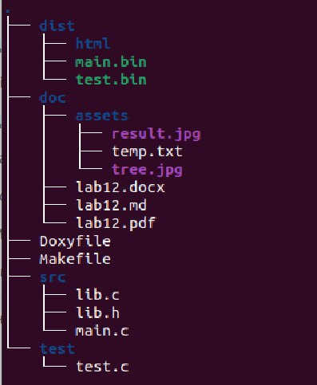
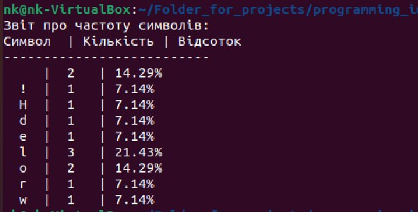

@mainpage

# Лабораторна робота № 12
### 1.1 Розробник


@author Іовов Микита ( КН-923Б)
@date 20.05.2024
@version 1.8.17


### 1.2 Загальне завдання
Сформувати частотну таблицю символів у тексту та вивести її на екран (з вказанням
кількості та процентного відношення). Обмеження - виводити тільки ті символи, що
зустрічаються у тексті.

## 2 Опис програми
### 2.1 Функціональне призначення 
Підрахунок частоти символів.

### 2.2 Обмеження на застосування
Обмеження - виводити тільки ті символи, що
зустрічаються у тексті.


### 2.3 Опис логічної структури
* main.c: Основний файл програми, де ініціалізуються функції calculateFrequency() і print_frequency_table() для зчитування данних та підрахунку частотності символів:
```


#include <stdio.h>
#include "lib.h"


#define BUFFER_SIZE 1000


int main() {
    char buffer[BUFFER_SIZE];
    int char_count[ASCII_SIZE] = {0};
    int total_chars = 0;

    // Зчитуємо дані зі стандартного вводу
    if (fgets(buffer, BUFFER_SIZE, stdin) != NULL) {
        // Підраховуємо кількість кожного символу
        calculate_frequency(buffer, char_count, &total_chars);

        // Виводимо таблицю частот символів
        print_frequency_table(char_count, total_chars);
    } else {
        fprintf(stderr, "Error reading input.\n");
        return 1;
    }

    return 0;
}
```


* lib.с: Файл з функціями calculateFrequency() і print_frequency_table() для зчитування данних та підрахунку частотності символів:
```
#include <stdio.h>
#include "lib.h"

void print_frequency_table(const int char_count[ASCII_SIZE], int total_chars) {
    printf("Character Frequency Table:\n");
    printf("Char | Count | Percentage\n");
    printf("-----+-------+-----------\n");

    for (int i = 0; i < ASCII_SIZE; i++) {
        if (char_count[i] > 0) {
            double percentage = (char_count[i] / (double)total_chars) * 100;
            printf("  %c  |  %4d |  %7.2f%%\n", i, char_count[i], percentage);
        }
    }
}


void calculate_frequency(const char *buffer, int char_count[ASCII_SIZE], int *total_chars) {
    *total_chars = 0;
    for (size_t i = 0; i < strlen(buffer); i++) {
        char_count[(unsigned char)buffer[i]]++;
        (*total_chars)++;
    }
}

```


* lib.h: Заголовочний файл, що містить прототипи функцій calculateFrequency() та print_frequency_table: 
```
/**
 * @file lib.h
 * @brief Оголошення функції для підрахунку частоти символів у файлі.
 */


#ifndef LIB_H
#define LIB_H

#include <stdio.h>
#include <stdlib.h>
#include <ctype.h>
#include <string.h>
#define ASCII_SIZE 256


/**
 * @brief Виводить таблицю частот символів.
 * 
 * @details Ця функція приймає масив частот символів та загальну кількість символів,
 * потім виводить таблицю, яка показує частоту та відсоток кожного символу.
 * 
 * @param char_count Масив, що містить частоту кожного символу.
 * @param total_chars Загальна кількість символів у вхідному буфері.
 */

void print_frequency_table(const int char_count[ASCII_SIZE], int total_chars);


/**
 * @brief Розраховує частоту кожного символу в заданому буфері.
 * 
 * @details Ця функція приймає буфер і розраховує частоту кожного символу
 * в буфері. Результати зберігаються в масиві char_count, а загальна
 * кількість символів зберігається в total_chars.
 * 
 * @param buffer Вхідний рядок буфера.
 * @param char_count Масив для зберігання частоти кожного символу.
 * @param total_chars Вказівник на ціле число, в якому буде зберігатись загальна кількість символів.
 */

void calculate_frequency(const char *buffer, int char_count[ASCII_SIZE], int *total_chars);


#endif
```


* test.c:  Містить тестовий запуск функцій для завідомо відомих даних:
```


#include <check.h>
#include <assert.h>
#include "lib.h"


/**
 * @brief Тестовий випадок для функції calculate_frequency.
 * 
 * Цей тестовий випадок перевіряє правильність функції calculate_frequency шляхом
 * порівняння розрахованих частот та загальної кількості символів з очікуваними значеннями.
 */
 
 
START_TEST(test_calculate_frequency) {
    char buffer[] = "hello world";
    int char_count[ASCII_SIZE] = {0};
    int total_chars = 0;

    calculate_frequency(buffer, char_count, &total_chars);

    ck_assert_int_eq(char_count['h'], 1);
    ck_assert_int_eq(char_count['e'], 1);
    ck_assert_int_eq(char_count['l'], 3);
    ck_assert_int_eq(char_count['o'], 2);
    ck_assert_int_eq(char_count[' '], 1);
    ck_assert_int_eq(char_count['w'], 1);
    ck_assert_int_eq(char_count['r'], 1);
    ck_assert_int_eq(char_count['d'], 1);
    ck_assert_int_eq(total_chars, 11);
}
END_TEST


/**
 * @brief Створює тестовий набір для функцій роботи з частотою.
 * 
 * Ця функція створює і повертає тестовий набір для функцій роботи з частотою.
 * 
 * @return Suite* Вказівник на створений тестовий набір.
 */
 
Suite * frequency_suite(void) {
    Suite *s;
    TCase *tc_core;

    s = suite_create("Frequency");

    /* Core test case */
    tc_core = tcase_create("Core");

    tcase_add_test(tc_core, test_calculate_frequency);
    suite_add_tcase(s, tc_core);

    return s;
}


/**
 * @brief Основна функція для запуску тестового набору.
 * 
 * Ця функція запускає створений тестовий набір і повертає результат.
 * 
 * @return int Повертає 0, якщо всі тести пройшли успішно, 1, якщо будь-який тест провалився.
 */
 
 
 
int main(void) {
    int number_failed;
    Suite *s;
    SRunner *sr;

    s = frequency_suite();
    sr = srunner_create(s);

    srunner_run_all(sr, CK_NORMAL);
    number_failed = srunner_ntests_failed(sr);
    srunner_free(sr);
    return (number_failed == 0) ? 0 : 1;
}
```

### 2.2.3 Структура проекту



### 2.4 Важливі фрагменти програми
- Включення заголовочних файлів.
- Створення тестового набору.
- Запуск тестів та вивід результатів.

# 2 Варіанти використання
Для представлення виконання кожного завдання використовується:
- виведення результатів у консоль за допомогою функції виводу;
- юніт-тест;

### Варіант використання 1
- Формування таблиці частотності символів.

Інструкція для запуску програми за допомогою юніт-тесту:
- Виклик юніт тесту за допомогою команди ./test.bin.

Інструкція для запуску програми:
- Ввести команду: cat ./assets/input.txt | ./dist/main.bin для зчитування данних з текстового файлу програмою main.bin.



### Результат:
Як бачимо, програма коректно формує таблицю частотності символів текстового файла.

# Висновок
Програма є ефективним інструментом для статистичного аналізу текстових даних. Вона дозволяє отримати детальну інформацію про розподіл символів у тексті, що може бути корисно для різних дослідницьких та прикладних завдань. Використання стандартних бібліотек C дозволяє забезпечити коректність роботи з файлами та символами, а також спрощує реалізацію основних функцій програми.
