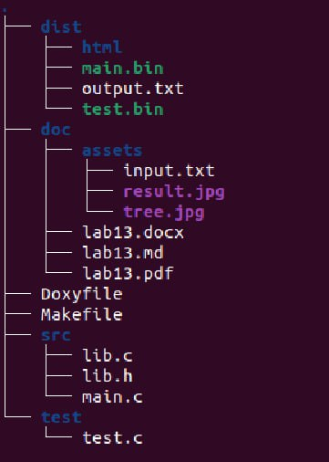
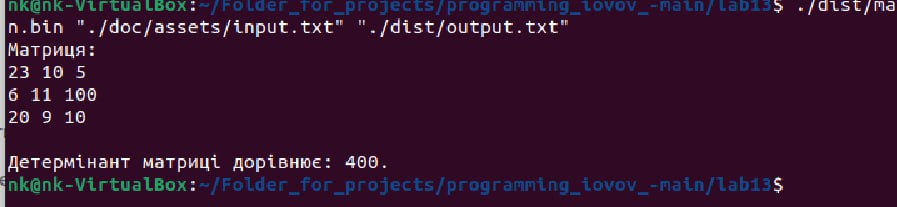

@mainpage

# Лабораторна робота № 13
### 1.1 Розробник


@author Іовов Микита ( КН-923Б)
@date 20.05.2024
@version 1.8.17


### 1.2 Загальне завдання
Визначити детермінант матриці якщо він існує.

## 2 Опис програми
### 2.1 Функціональне призначення 
Програма визначає детермінант матриці.

### 2.2 Обмеження на застосування
Програма може працювати повільно або неефективно для дуже великих матриць через обмеження пам'яті та обчислювальної потужності. 

### 2.3 Опис логічної структури
* main.c: Основний файл програми, де ініціалізуються функції readMatrixFromFile(), determinant()  і freeMatrix()для зчитування матриці з файлу та обчислення визначника матриці:

```
/**

 * @file main.c

 * @brief Головний файл програми для читання матриці з файлу, обчислення її детермінанта та запису результату у вихідний файл.

 */


#include "lib.h"


/**

 * @brief Головна функція програми.

 * 

 * @param argc Кількість аргументів командного рядка.

 * @param argv Массив аргументів командного рядка.

 * @return int Код завершення програми (0 - успішне виконання, 1 - помилка).

 */

int main(int argc, char *argv[]) {

    if (argc != 3) {

        printf("Usage: %s <input_file> <output_file>\n", *(argv + 0));

        return 1;

    }


    const char *input_filename = *(argv + 1);

    const char *output_filename = *(argv + 2);


    int **matrix;

    int rows, cols;


    // Читаємо матрицю з файлу

    matrix = readMatrixFromFile(input_filename, &rows, &cols);

    if (matrix == NULL) {

        printf("Помилка зчитування матриці з файлу %s.\n", input_filename);

        return 1;

    }


    // Виводимо матрицю для перевірки

    printf("Матриця: \n");

    for (int i = 0; i < rows; i++) {

        for (int j = 0; j < cols; j++) {

            printf("%d ", *(*(matrix + i) + j)); // використання лише розіменування

        }

        printf("\n");

    }


    // Перевіряємо, що матриця квадратна (кількість рядків дорівнює кількості стовпців)

    if (rows != cols) {

        printf("Матриця не є квадратною, не можливо розрахувати детермінант.\n");

        freeMatrix(matrix, rows);

        return 1;

    }


    // Обчислюємо визначник матриці

    int det = determinant(matrix, rows);


    // Записуємо результат у вихідний файл

    FILE *output_file = fopen(output_filename, "w");

    if (output_file == NULL) {

        printf("Помилка при відкритті вихідного файлу %s.\n", output_filename);

        freeMatrix(matrix, rows);

        return 1;

    }


    printf("\nДетермінант матриці дорівнює: %d.\n", det);

    fprintf(output_file, "Детермінант матриці з файлу %s дорівнює %d.\n", input_filename, det);

    fprintf(output_file, "\nМатриця: \n");

    for (int i = 0; i < rows; i++) {

        for (int j = 0; j < cols; j++) {

            fprintf(output_file, "%d ", *(*(matrix + i) + j)); // використання лише розіменування

        }

        fprintf(output_file, "\n");

    }

    fclose(output_file);


   

    freeMatrix(matrix, rows);

    


    return 0;

}


```

* lib.с: Файл з функціями readMatrixFromFile(), determinant()  і freeMatrix()для зчитування матриці з файлу та обчислення визначника матриці:

```
/**

 * @file lib.c

 * @brief Реалізація функцій для роботи з матрицями.

 */


#include <stdio.h>

#include <stdlib.h>

#include "lib.h"


/**

 * @brief Зчитує матрицю з файлу.

 * 

 * @param filename Ім'я файлу.

 * @param rows Вказівник на кількість рядків.

 * @param cols Вказівник на кількість стовпців.

 * @return int** Вказівник на зчитану матрицю, або NULL у разі помилки.

 */

int **readMatrixFromFile(const char *filename, int *rows, int *cols) {

    FILE *fp;

    int **matrix = NULL;

    int i, j;


    // Відкриваємо файл для читання

    fp = fopen(filename, "r");

    if (fp == NULL) {

        printf("Помилка при відкритті файлу %s.\n", filename);

        return NULL;

    }


    // Зчитуємо кількість рядків і стовпців

    fscanf(fp, "%d %d", rows, cols);


    // Виділяємо пам'ять під матрицю

    matrix = (int **)malloc((size_t)(*rows) * sizeof(int *));

    if (matrix == NULL) {

        printf("Помилка виділення пам'яті.\n");

        fclose(fp);

        return NULL;

    }


    for (i = 0; i < *rows; i++) {

        *(matrix + i) = (int *)malloc((size_t)(*cols) * sizeof(int));

        if (*(matrix + i) == NULL) {

            printf("Помилка виділення пам'яті.\n");

            fclose(fp);

            freeMatrix(matrix, i);

            return NULL;

        }

    }


    // Зчитуємо елементи матриці

    for (i = 0; i < *rows; i++) {

        for (j = 0; j < *cols; j++) {

            fscanf(fp, "%d", (*(matrix + i) + j)); // використання лише розіменування

        }

    }


    

    fclose(fp);


    return matrix;

}


/**

 * @brief Обчислює визначник матриці.

 * 

 * @param matrix Вказівник на матрицю.

 * @param n Розмір матриці (кількість рядків/стовпців).

 * @return int Визначник матриці.

 */

int determinant(int **matrix, int n) {

    int det = 0;


    

    if (n == 1) {

        return *(*(matrix + 0) + 0);

    }


    // Для матриць більшого розміру обчислюємо визначник за методом розкладу по першому рядку

    int sign = 1;

    for (int i = 0; i < n; i++) {

        // Обчислюємо мінор матриці

        int **minor = (int **)malloc((size_t)(n - 1) * sizeof(int *));

        for (int k = 0; k < n - 1; k++) {

            *(minor + k) = (int *)malloc((size_t)(n - 1) * sizeof(int));

        }


        // Заповнюємо мінор, виключаючи поточний рядок і стовпець i

        for (int j = 1; j < n; j++) {

            for (int k = 0; k < n; k++) {

                if (k < i) {

                    *(*(minor + j - 1) + k) = *(*(matrix + j) + k);

                } else if (k > i) {

                    *(*(minor + j - 1) + k - 1) = *(*(matrix + j) + k);

                }

            }

        }


        // Обчислюємо визначник мінора і додаємо до загального визначника з урахуванням знака

        det += sign * *(*(matrix + 0) + i) * determinant(minor, n - 1);


        

        for (int k = 0; k < n - 1; k++) {

            free(*(minor + k));

        }

        free(minor);


        // Змінюємо знак для наступного мінора

        sign = -sign;

    }


    return det;

}


/**

 * @brief Звільняє пам'ять, виділену під матрицю.

 * 

 * @param matrix Вказівник на матрицю.

 * @param rows Кількість рядків у матриці.

 */

void freeMatrix(int **matrix, int rows) {

    if (matrix == NULL) return;


    for (int i = 0; i < rows; i++) {

        free(*(matrix + i));

    }

    free(matrix);

}


```

* lib.h: Заголовочний файл, що містить прототипи функцій readMatrixFromFile(), determinant()  і freeMatrix(): 

```
/**

 * @file lib.h

 * @brief Заголовковий файл з визначенням функцій для роботи з матрицями.

 */


#ifndef LIB_H

#define LIB_H


#include <stdio.h>

#include <stdlib.h>


/**

 * @brief Зчитує матрицю з файлу.

 * 

 * @param filename Ім'я файлу.

 * @param rows Вказівник на кількість рядків.

 * @param cols Вказівник на кількість стовпців.

 * @return int** Вказівник на зчитану матрицю, або NULL у разі помилки.

 */

int **readMatrixFromFile(const char *filename, int *rows, int *cols);


/**

 * @brief Обчислює визначник матриці.

 * 

 * @param matrix Вказівник на матрицю.

 * @param n Розмір матриці (кількість рядків/стовпців).

 * @return int Визначник матриці.

 */

int determinant(int **matrix, int n);


/**

 * @brief Звільняє пам'ять, виділену під матрицю.

 * 

 * @param matrix Вказівник на матрицю.

 * @param rows Кількість рядків у матриці.

 */

void freeMatrix(int **matrix, int rows);


#endif // LIB_H


```

* test.c:  Містить тестовий запуск функцій для завідомо відомих даних:

```
/**

 * @file test.c

 * @brief Тестовий файл для перевірки функцій роботи з матрицями.

 */


#include <stdio.h>

#include <stdlib.h>

#include "lib.h"


/**

 * @brief Тестує функцію readMatrixFromFile.

 */

void test_readMatrixFromFile() {

    int rows, cols;

    int **matrix = readMatrixFromFile("matrix.txt", &rows, &cols);


    if (matrix == NULL) {

        printf("Помилка зчитування матриці з файлу matrix.txt.\n");

        return;

    }


    printf("Матриця з файлу matrix.txt:\n");

    for (int i = 0; i < rows; i++) {

        for (int j = 0; j < cols; j++) {

            printf("%d ", *(*(matrix + i) + j)); 

        }

        printf("\n");

    }


    freeMatrix(matrix, rows);

}


/**

 * @brief Тестує функцію determinant.

 */

void test_determinant() {

    int rows = 3, cols = 3;

    int **matrix = (int **)malloc((size_t)rows * sizeof(int *));

    for (int i = 0; i < rows; i++) {

        *(matrix + i) = (int *)malloc((size_t)cols * sizeof(int));

    }


    // Заповнюємо матрицю

    int values[3][3] = {{1, 2, 3}, {0, 1, 4}, {5, 6, 0}};

    for (int i = 0; i < rows; i++) {

        for (int j = 0; j < cols; j++) {

            *(*(matrix + i) + j) = *(*(values + i) + j); 

        }

    }


    // Обчислюємо визначник

    int det = determinant(matrix, rows);

    printf("Визначник матриці дорівнює %d\n", det);


    freeMatrix(matrix, rows);

}


/**

 * @brief Головна функція для запуску тестів.

 * 

 * @return int Код завершення програми (0 - успішне виконання).

 */

 

int main() {

    test_readMatrixFromFile();

    test_determinant();

    return 0;

}


```


### 2.2.3 Структура проекту


### 2.4 Важливі фрагменти програми
- Включення заголовочних файлів.
- Створення тестового набору.
- Запуск тестів та вивід результатів.

# 2 Варіанти використання
Для представлення виконання кожного завдання використовується:
- виведення результатів у консоль за допомогою запуску програми з відповідними аргументами;
- юніт-тест;

### Варіант використання 1
- Визначення детермінанту матриці.

Інструкція для запуску програми за допомогою юніт-тесту:
- Виклик юніт тесту за допомогою команди ./test.bin.

Інструкція для запуску програми:
- Ввести команду: ./dist/main.bin "./assets/input.txt" "./dist/output.txt"



### Результат:
Як бачимо, програма коректно зчитує матрицю з текстового файлу та визначає детермінант.


# Висновок
У цьому звіті представлено програму для обчислення визначника матриці, яка зчитується з файлу, з використанням мови програмування C. Програма демонструє ефективне використання динамічної пам'яті, а також включає базові механізми обробки помилок.
