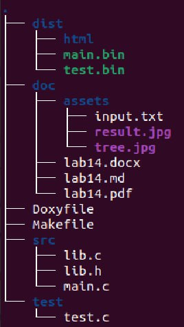
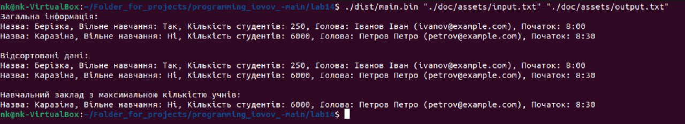

@mainpage

# Лабораторна робота № 14
### 1.1 Розробник


@author Іовов Микита ( КН-923Б)
@date 20.05.2024
@version 1.8.17


### 1.2 Загальне завдання
- З розділу “Індивідуальні завдання комплексної роботи” взяти прикладну галузь стосовно
номеру варіанту за попередньо-визначеною формулою
- створити структуру, що відображає “базовий клас”

## 2 Опис програми
### 2.1 Функціональне призначення 
Програма для зчитування, обробки, сортування та запису данних навчальних закладів.

### 2.2 Обмеження на застосування
Підтримка української мови та правильна обробка символів Unicode можуть стати проблемою в різних середовищах або залежно від налаштувань операційної системи.

### 2.3 Опис логічної структури
* main.c: Основний файл програми, де ініціалізуються функції readDataFromFile(), writeDataToFile(), printData(), sortDataByTotalStudents() і  EducationalInstitution* findInstitutionWithMaxStudents()для зчитування, обробки, сортування та запису данних навчальних закладів: 

```
/**

 * @file main.c

 * @brief Головний файл програми.

 */


#include "lib.h"


/**

 * @brief Основна функція, яка зчитує, обробляє, сортує та записує дані навчальних закладів.

 *

 * @param argc Кількість аргументів командного рядка.

 * @param argv Масив рядків аргументів командного рядка.

 * @return 0 у разі успішного виконання, 1 у випадку помилки (некоректне використання або операції з файлами).

 */  

 

int main(int argc, char *argv[]) {


if (argc != 3) {


    fprintf(stderr, "Usage: %s <input_file>\n", *(argv + 0));


    return 1;


}


const char *filename = *(argv + 1);


EducationalInstitution *institutions = NULL;


int size = 0;


readDataFromFile(&institutions, &size, filename);


if (institutions == NULL) {


    return 1;


}


printf("Загальна інформація:\n");


printData(institutions, size);


sortDataByTotalStudents(institutions, size);


printf("\nВідсортовані дані:\n");


printData(institutions, size);


EducationalInstitution *maxInstitution = findInstitutionWithMaxStudents(institutions, size);


if (maxInstitution != NULL) {


    printf("\nНавчальний заклад з максимальною кількістю учнів:\n");


    printData(maxInstitution, 1);


}


writeDataToFile(institutions, size, *(argv + 2));


free(institutions);


return 0;

}
```

* lib.с: Файл з реалізаціями функцій readDataFromFile(), writeDataToFile(), printData(), sortDataByTotalStudents() і  EducationalInstitution* findInstitutionWithMaxStudents() для зчитування, обробки, сортування та запису данних навчальних закладів: 

```


/**

 * @file lib.c

 * @brief Реалізація функцій для роботи з файлами і структурами данних.

 */


#include "lib.h"


/**

 * @brief Функція для зчитування даних про навчальні заклади з файлу у пам'ять.

 *

 * @param institutions Вказівник на масив структур EducationalInstitution.

 * @param size Вказівник на розмір масиву institutions.

 * @param filename Ім'я вхідного файлу для зчитування даних.

 */


void readDataFromFile(EducationalInstitution **institutions, int *size, const char *filename) {


FILE *file = fopen(filename, "r");


if (!file) {


    fprintf(stderr, "Error opening file: %s\n", filename);


    return;


}


if (fscanf(file, "%d", size) != 1 || *size <= 0) {


    fprintf(stderr, "Error reading size from file or size is invalid.\n");


    fclose(file);


    return;


}


*institutions = (EducationalInstitution *)malloc((size_t)(*size) * sizeof(EducationalInstitution));


if (!*institutions) {


    fprintf(stderr, "Memory allocation failed.\n");


    fclose(file);


    return;


}


for (int i = 0; i < *size; i++) {


    int startTime;


    if (fscanf(file, "%d %99s %d %99s %99s %99s %d",


               &(*institutions)[i].isFreeEducation, (*institutions)[i].name,


               &(*institutions)[i].totalStudents, (*institutions)[i].head.surname,


               (*institutions)[i].head.name, (*institutions)[i].head.email, &startTime) != 7) {


        fprintf(stderr, "Error reading institution data from file.\n");


        free(*institutions);


        fclose(file);


        return;


    }


    (*institutions)[i].startTime = (StartTime)startTime;


}


fclose(file);

}


/**

 * @brief Функція для запису даних про навчальні заклади з пам'яті у файл.

 *

 * @param institutions Вказівник на масив структур EducationalInstitution.

 * @param size Розмір масиву institutions.

 * @param filename Ім'я вихідного файлу для запису даних.

 */

 

void writeDataToFile(EducationalInstitution *institutions, int size, const char *filename) {


FILE *file = fopen(filename, "w");


if (!file) {


    fprintf(stderr, "Error opening file for writing: %s\n", filename);


    return;


}


fprintf(file, "%d\n", size);


for (int i = 0; i < size; i++) {


    fprintf(file, "%d %s %d %s %s %s %d\n",


            institutions[i].isFreeEducation, institutions[i].name,


            institutions[i].totalStudents, institutions[i].head.surname,


            institutions[i].head.name, institutions[i].head.email, institutions[i].startTime);


}


fclose(file);

}


/**

 * @brief Функція для виведення даних про навчальні заклади на стандартний вивід.

 *

 * @param institutions Вказівник на масив структур EducationalInstitution.

 * @param size Розмір масиву institutions.

 */

 

void printData(EducationalInstitution *institutions, int size) {


for (int i = 0; i < size; i++) {


    printf("Назва: %s, Вільне навчання: %s, Кількість студентів: %d, Голова: %s %s (%s), Початок: ",


           institutions[i].name, 


           institutions[i].isFreeEducation ? "Так" : "Ні",


           institutions[i].totalStudents,


           institutions[i].head.surname, institutions[i].head.name, institutions[i].head.email);


    switch (institutions[i].startTime) {


        case STANDARD_8:


            printf("8:00\n");


            break;


        case LATER_830:


            printf("8:30\n");


            break;


        case SECOND_SHIFT_1430:


            printf("14:30\n");


            break;


        default:


            printf("Unknown\n");


    }


}

}


/**

 * @brief Функція для сортування навчальних закладів за загальною кількістю студентів у порядку зростання.

 *

 * @param institutions Вказівник на масив структур EducationalInstitution.

 * @param size Розмір масиву institutions.

 */

 

void sortDataByTotalStudents(EducationalInstitution *institutions, int size) {


for (int i = 0; i < size - 1; i++) {


    for (int j = 0; j < size - i - 1; j++) {


        if (institutions[j].totalStudents > institutions[j + 1].totalStudents) {


            EducationalInstitution temp = *(institutions + j);


            *(institutions + j) = *(institutions + j + 1);


            *(institutions + j + 1) = temp;


        }


    }


}

}


/**

 * @brief Функція для пошуку навчального закладу з найбільшою кількістю студентів.

 *

 * @param institutions Вказівник на масив структур EducationalInstitution.

 * @param size Розмір масиву institutions.

 * @return Вказівник на EducationalInstitution з найбільшою кількістю студентів, або NULL, якщо size <= 0.

 */


EducationalInstitution* findInstitutionWithMaxStudents(EducationalInstitution *institutions, int size) {


if (size <= 0) return NULL;


EducationalInstitution *maxInstitution = &institutions[0];


for (int i = 1; i < size; i++) {


    if (institutions[i].totalStudents > maxInstitution->totalStudents) {


        maxInstitution = &institutions[i];


    }


}


return maxInstitution;

}


```


* lib.h: Заголовочний файл, що містить прототипи функцій:
readDataFromFile(), writeDataToFile(), printData(), sortDataByTotalStudents() і  EducationalInstitution* findInstitutionWithMaxStudents():

```
/**

 * @file lib.h

 * @brief Заголовковий файл з визначенням функцій.

 */


#ifndef LIB_H


#define LIB_H


#include <stdio.h>


#include <stdlib.h>


#include <string.h>


typedef enum {


STANDARD_8 = 0,


LATER_830,


SECOND_SHIFT_1430

} StartTime;


typedef struct {


char surname[100];


char name[100];


char email[100];

} Head;


typedef struct {


int isFreeEducation;


char name[100];


int totalStudents;


Head head;


StartTime startTime;

} EducationalInstitution;


/**

 * @brief Функція для зчитування даних про навчальні заклади з файлу у пам'ять.

 *

 * @param institutions Вказівник на масив структур EducationalInstitution.

 * @param size Вказівник на розмір масиву institutions.

 * @param filename Ім'я вхідного файлу для зчитування даних.

 */


void readDataFromFile(EducationalInstitution **institutions, int *size, const char *filename);


/**

 * @brief Функція для запису даних про навчальні заклади з пам'яті у файл.

 *

 * @param institutions Вказівник на масив структур EducationalInstitution.

 * @param size Розмір масиву institutions.

 * @param filename Ім'я вихідного файлу для запису даних.

 */


void writeDataToFile(EducationalInstitution *institutions, int size, const char *filename);


/**

 * @brief Функція для виведення даних про навчальні заклади на стандартний вивід.

 *

 * @param institutions Вказівник на масив структур EducationalInstitution.

 * @param size Розмір масиву institutions.

 */

 

void printData(EducationalInstitution *institutions, int size);


/**

 * @brief Функція для сортування навчальних закладів за загальною кількістю студентів у порядку зростання.

 *

 * @param institutions Вказівник на масив структур EducationalInstitution.

 * @param size Розмір масиву institutions.

 */

void sortDataByTotalStudents(EducationalInstitution *institutions, int size);


/**

 * @brief Функція для пошуку навчального закладу з найбільшою кількістю студентів.

 *

 * @param institutions Вказівник на масив структур EducationalInstitution.

 * @param size Розмір масиву institutions.

 * @return Вказівник на EducationalInstitution з найбільшою кількістю студентів, або NULL, якщо size <= 0.

 */

 

EducationalInstitution* findInstitutionWithMaxStudents(EducationalInstitution *institutions, int size);


#endif // LIB_H
```


* test.c:  Містить тестовий запуск функцій для завідомо відомих даних:

```
#include <check.h>

#include <stdio.h>

#include "../src/lib.h"


// Прототип функції для підготовки тестових даних

void prepareTestData(const char *filename);


START_TEST(test_readDataFromFile) {

    EducationalInstitution *institutions = NULL;

    int size = 0;


    // Підготовка тестових даних перед читанням

    prepareTestData("./test/test_data.txt");


    const char *filename = "./test/test_data.txt";  // Використання підготовлених тестових даних


    readDataFromFile(&institutions, &size, filename);


    ck_assert_ptr_nonnull(institutions);

    ck_assert_int_eq(size, 2);


    // Перевірки на основі тестових даних

    ck_assert_int_eq(institutions[0].isFreeEducation, 1);

    ck_assert_str_eq(institutions[0].name, "Берізка");

    ck_assert_int_eq(institutions[0].totalStudents, 250);

    ck_assert_str_eq(institutions[0].head.surname, "Іванов");

    ck_assert_str_eq(institutions[0].head.name, "Іван");

    ck_assert_str_eq(institutions[0].head.email, "ivanov@example.com");

    ck_assert_int_eq(institutions[0].startTime, STANDARD_8);


    free(institutions);

}


END_TEST


Suite *educational_institution_suite(void) {

    Suite *s;

    TCase *tc_core;


    s = suite_create("EducationalInstitution");

    tc_core = tcase_create("Core");


    tcase_add_test(tc_core, test_readDataFromFile);

    suite_add_tcase(s, tc_core);


    return s;

}


int main(void) {

    int number_failed;

    Suite *s;

    SRunner *sr;


    

    prepareTestData("./test/input.txt");


    s = educational_institution_suite();

    sr = srunner_create(s);


    srunner_run_all(sr, CK_NORMAL);

    number_failed = srunner_ntests_failed(sr);

    srunner_free(sr);


    return (number_failed == 0) ? 0 : 1;

}


void prepareTestData(const char *filename) {

    FILE *file = fopen(filename, "w");

    if (!file) {

        fprintf(stderr, "Error opening file for writing: %s\n", filename);

        return;

    }


    fprintf(file, "2\n");

    fprintf(file, "1 Берізка 250 Іванов Іван ivanov@example.com 0\n");

    fprintf(file, "0 Дубова 180 Петров Петро petrov@example.com 1\n");


    fclose(file);

}


```


### 2.2.3 Структура проекту



### 2.4 Важливі фрагменти програми
- Включення заголовочних файлів.
- Створення тестового набору.
- Запуск тестів та вивід результатів.


# 2 Варіанти використання
Для представлення виконання кожного завдання використовується:
- виведення результатів у консоль за допомогою запуску програми з відповідними аргументами;
- юніт-тест;

### Варіант використання 1
- Обробка данних навчальних закладів.


Інструкція для запуску програми за допомогою юніт-тесту:
- Виклик юніт тесту за допомогою команди ./test.bin.

Інструкція для запуску програми:
- Ввести команду: ./dist/main.bin "./assets/input.txt" "./dist/output.txt"





### Результат:
Як бачимо, програма коректно зчитує інформацію  з текстового файлу та обробляє її.


# Висновок
У цьому звіті представлено програму для для зчитування, обробки, сортування та запису данних навчальних закладів, які зчитується з файлу, з використанням мови програмування C. Програма демонструє ефективне використання динамічної пам'яті, а також включає базові механізми обробки помилок.